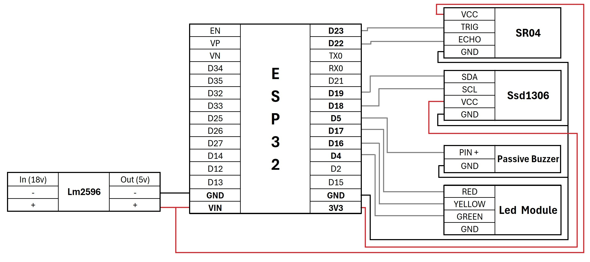

<h1>Catedra de Electrónica II - UTN FRRO </h1>
<h1>TP FINAL ESP32 - Sensor de estacionamiento trasero</h1>

# Sensor de Estacionamiento con ESP32

Este proyecto consiste en un sensor de estacionamiento basado en ESP32, utilizando un sensor de ultrasonido SR04 y una pantalla OLED para mostrar la distancia medida. Además, el ESP32 está conectado a Internet para enviar los datos a una computadora.

## Características
- Medición de distancia con el sensor ultrasónico HC-SR04.
- Visualización de la distancia en una pantalla OLED.
- Conexión Wi-Fi para el envío de datos.
- Uso del protocolo MQTT para comunicación con Mosquitto.
- Interfaz de usuario en Node-RED Dashboard con sliders para ajustar variables.
- Envío automático de valores desde Node-RED cada vez que cambian los sliders.
- Desarrollo con PlatformIO.

## Requisitos
### Hardware
- ESP32
- Sensor de ultrasonido HC-SR04
- Pantalla OLED (SSD1306)
- Cables de conexión
- Fuente de alimentación adecuada

### Software
- [PlatformIO](https://platformio.org/) instalado en VS Code
- Dependencias necesarias (ver `platformio.ini`)
- Mosquitto (Broker MQTT)
- Node-RED (para visualizar los datos y controlar parámetros)

## Instalación y Configuración
1. Configurar PlatformIO
Instala PlatformIO en VS Code o como extensión en otro editor compatible.
Clona este repositorio:
sh
Copiar
Editar
git clone https://github.com/manubengio/SensorESP32.git
Abre la carpeta del proyecto en PlatformIO.
Configura las credenciales Wi-Fi en el archivo de configuración (por ejemplo, en config.h).
Compila y carga el código en el ESP32.
2. Configurar Mosquitto
Instala Mosquitto en tu PC o servidor.
Configura el broker MQTT y asegúrate de que esté en funcionamiento.
3. Configurar Node-RED
Instala Node-RED y los nodos adicionales necesarios.
Importa el flujo de Node-RED desde el archivo flow_nodered.json disponible en el repositorio. Puedes hacerlo desde el menú de Node-RED seleccionando "Importar" y eligiendo el archivo:
sh
Copiar
Editar
flow_nodered.json
Configura el nodo MQTT en Node-RED con los detalles de tu broker y asegúrate de usar el tema parking como en el archivo.
Accede al Node-RED Dashboard para visualizar los datos y controlar los parámetros.
   

### Compilación y Carga en la Placa 
1. Conectar el ESP32 a la computadora mediante USB.
2. Seleccionar el puerto serie adecuado en PlatformIO.
3. Compilar y cargar el firmware ejecutando:
   ```sh
   pio run --target upload
   ```
4. Para ver la salida en serie:
   ```sh
   pio device monitor
   ```

## Diagrama de conexión 


## Uso
- Enciende el ESP32 y conéctalo a la red Wi-Fi configurada.
- Abre Node-RED Dashboard en tu navegador para visualizar la distancia medida y ajustar los valores de las variables.
- Los valores de los sliders en Node-RED se envían automáticamente al ESP32 cada vez que se cambian.
- Observa la medición de distancia en la pantalla OLED del ESP32.


## Contribuciones
Si deseas contribuir, por favor abre un issue o envía un pull request.

## Licencia
Este proyecto está bajo la licencia MIT. Ver el archivo `LICENSE` para más detalles.

